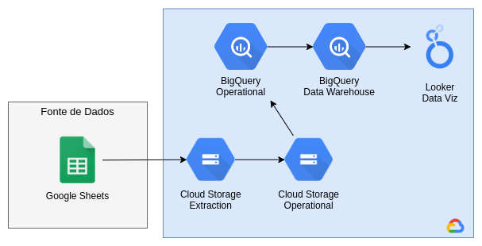

# pucminas-projeto3
Extensão - Desenvolvimento de Projeto de Business Intelligence - 2023/02

### Desenho da arquitetura de dados

 

### Comandos úteis
1. Criação de um ambiente virtual para o python, necessário ter venv instalado
    ~~~sh
    python3 -m venv venv
    ~~~
2. Instalação dos módulos necessários para rodar o projeto
    ~~~sh
    pip install -r requirements.txt
    ~~~
3. Criação de um módulo para ajuste dos imports das libs, necessário estar na raiz do projeto
    ~~~sh
    pip install -e .
    ~~~
